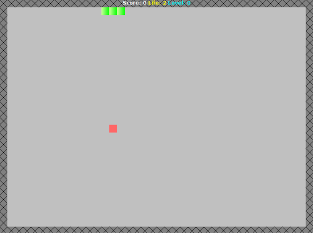

# Snake

## Description
This is a twist on the classic game of [Snakes](https://playsnake.org/).  
The objective of this version of the game is to complete all levels.  
As with the original, one loses when all health points are lost from collision with
the walls or the snake itself.  

### Extra features
 <b>Red square</b>: increases score and also the length of the snake.  
 <b>Detached wall barrier</b>: randomly distributed across the board; unlocked after level 0  
 <b>Golden nugget</b>: increases health points  

### Keys
* Arrow keys for movement
* `q` - quit
* `p` - pause
* `r` - restart
* `s` - start/continue

## Usage
Run `make` and then `make run`

## Screenshot

## Development Environment
Linux Mint
Java Version 1.8.0_91

## Sources
Sounds: http://www.grsites.com/archive/sounds/category/23/
